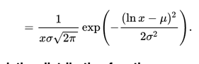

# Sizedirstibution 

## Variables

- NCONC01 ... NCONC14 -- concentration of particles in each mode
- SIGMA01 ... SIGMA14 -- standard deviation for each mode
- NMR01 ... NMR14  -- number median radius for each mode 

Distribution of each mode is log normal with the parameters above [wikipedia ](https://en.wikipedia.org/wiki/Log-normal_distribution).

For every mode: 
calculate the distribution by log normal distribution and add them all together.

- Check [Kirkevåg 2018](https://www.geosci-model-dev.net/11/3945/2018/)
- 